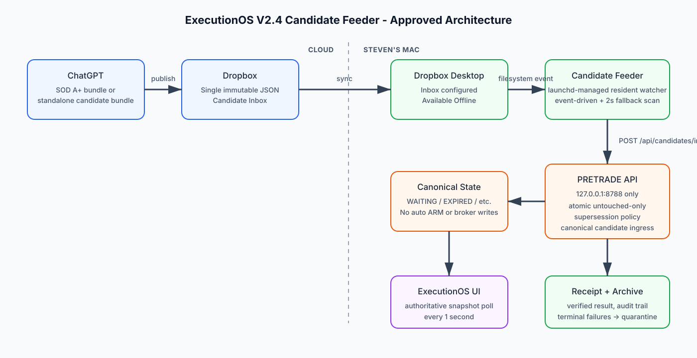

# ExecutionOS V2.4 Candidate Feeder - Design Baseline v1.0

**Status:** APPROVED / FROZEN FOR IMPLEMENTATION  
**Approval date:** September 9, 2026  
**Repository:** `sibolek/structure-based-trade-management`  
**Implementation branch:** `v24-candidate-feeder`  
**Canonical document:** `docs/ExecutionOS_V2.4_Candidate_Feeder_Design_Baseline_v1.0.md`

> This document is the approved engineering baseline for the ExecutionOS V2.4 Candidate Feeder. Implementation may refine internal code structure, names, and tests, but may not broaden authority, weaken fail-closed behavior, change candidate lineage semantics, expose PRETRADE beyond loopback, or relax the latency and acceptance requirements without a new explicit design decision.

---

## 1. Executive Summary

The Candidate Feeder automates one narrow transition:

**a completed canonical ExecutionOS candidate artifact becomes a canonical PRETRADE candidate on Steven's Mac.**

It supports both:

1. morning Start of Day (SOD) A+ candidate bundles; and
2. intraday standalone trade-card candidate bundles.

The approved transport is a Dropbox-backed candidate inbox synchronized to Steven's Mac. A small local feeder observes the synchronized inbox, validates each immutable JSON bundle, verifies the local PRETRADE service, and posts the exact candidate bundle to the existing canonical endpoint:

`POST http://127.0.0.1:8788/api/candidates/import`

The feeder does not decide whether a trade is valid, does not activate candidates, does not evaluate discretionary structure, does not choose quantity, does not acknowledge CAUTION, does not ARM, does not create Execution Board handoffs, and does not place, replace, cancel, or flatten broker orders.

The browser already refreshes the authoritative PRETRADE snapshot every 1 second, so newly imported candidates become viewable without a manual page refresh.



---

## 2. Goals

### 2.1 Primary goal

After ChatGPT finishes generating a canonical candidate artifact, the candidate should appear in ExecutionOS PRETRADE with minimal operator effort and minimal transport latency.

### 2.2 Supported producer workflows

- Full SOD package generation, including all A+ candidates.
- Standalone intraday trade card plus canonical candidate JSON.
- Explicit revision/update of an already published candidate.
- Exact retry after ambiguous delivery or transport failure.

### 2.3 Operational goal

Normal user workflow should be:

1. User requests an SOD or a trade card plus candidate.
2. ChatGPT generates the canonical candidate bundle.
3. ChatGPT publishes the bundle to the Dropbox Candidate Inbox.
4. Dropbox syncs the file to Steven's Mac.
5. The local feeder imports it into PRETRADE.
6. ExecutionOS UI displays the authoritative candidate state on its next normal refresh.

No manual `curl`, download, copy, paste, or PRETRADE page refresh should be required in the normal path.

---

## 3. Non-Goals and Explicit Authority Boundaries

The Candidate Feeder is **ingestion automation only**.

It MUST NOT:

- auto-ACTIVATE a candidate;
- evaluate discretionary structure;
- establish structural validity on behalf of the operator;
- acknowledge CAUTION;
- choose or override quantity;
- ARM a candidate;
- create an Execution Board handoff;
- write Execution Board canonical state;
- create LIVE execution state;
- bypass PRETRADE;
- place, replace, cancel, or flatten broker orders;
- refresh, write, or otherwise expand broker-token authority;
- interpret candidate omission from a later bundle as invalidation;
- rewrite candidate content to make an import pass;
- expose PRETRADE to the public internet.

**Broker write authority remains NONE.**

PRETRADE remains bound to loopback, with default endpoint `127.0.0.1:8788`.

---

## 4. Existing Canonical V2.4 Components Reused

The project deliberately reuses the existing V2.4 architecture rather than creating a parallel candidate authority.

### 4.1 Reused ingress

- `schwab-bridge/pretrade-candidate-ingress.mjs`
- `POST /api/candidates/import`
- canonical content hashing
- candidate contract versioning
- duplicate/conflict/stale detection
- canonical persistence
- validity reconciliation

### 4.2 Reused state projection

- `GET /api/candidates`
- ExecutionOS PRETRADE UI projection
- `usePretradeState` browser refresh loop

The current UI refresh interval is 1000 ms. This is sufficient for the approved latency target and does not need to be reduced as part of this project unless measured end-to-end performance proves otherwise.

### 4.3 Reused source

For V2.4 Candidate Feeder v1.0, canonical candidate source remains:

`SOD_A_PLUS_TRADES`

This source is used for both full SOD candidates and standalone trade-card candidates because the current accepted V2.4 candidate contract already supports that path. Standalone origin is distinguished through provenance fields such as:

- `conversionPurpose: STANDALONE_TRADE_CARD_TO_EXECUTIONOS_CANDIDATE`
- `standaloneTradeCard: true`

No new source authority is introduced in v1.0.

---

## 5. Cloud-to-Local Transport Decision

### 5.1 Approved transport

Dropbox is the approved cloud-to-Mac transport for v1.0.

The local PRETRADE service is never exposed externally. ChatGPT writes a canonical bundle to Dropbox; Dropbox Desktop synchronizes it to the Mac; only the local feeder talks to PRETRADE.

### 5.2 Approved Dropbox namespace

The transport root is:

`/ExecutionOS/Candidates`

with these child folders:

- `/ExecutionOS/Candidates/inbox`
- `/ExecutionOS/Candidates/receipts`
- `/ExecutionOS/Candidates/archive`
- `/ExecutionOS/Candidates/quarantine`

Optional non-transport SOD packages may live elsewhere, for example `/ExecutionOS/SOD/packages`, but the PRETRADE delivery path is intentionally generic.

### 5.3 Local path configuration

The Mac-side Dropbox path MUST NOT be hard-coded because Dropbox Desktop paths vary by macOS and account configuration.

The feeder will use an explicit installation-time configuration value, for example:

`EXECUTIONOS_CANDIDATE_INBOX=/actual/local/Dropbox/path/ExecutionOS/Candidates/inbox`

The installer/startup preflight must verify the directory exists and is writable/readable as required.

### 5.4 Available Offline requirement

The entire `/ExecutionOS/Candidates` Dropbox subtree MUST be configured as **Available Offline** on Steven's Mac.

This prevents online-only placeholders from inserting another lazy-download step between local file observation and PRETRADE import.

---

## 6. Publication Contract: One Immutable JSON File

The approved publication protocol uses **one immutable JSON file per publication**.

There is no `.ready` sidecar file.

This reduces:

- Dropbox writes;
- cloud propagation events;
- ordering dependencies;
- failure modes;
- normal-case latency.

### 6.1 SOD publication naming

Full SOD bundles retain the established bundle lineage, for example:

`sod-2026-09-09-a-plus-trades-v1.json`

### 6.2 Standalone publication naming

Standalone bundles use a unique publication name derived from the publication timestamp and candidate identity, for example:

`candidate-feed-2026-09-09-160412123Z-nvda-long.json`

The filename is transport metadata only. Canonical candidate identity remains inside the JSON.

### 6.3 No overwrite

Published bundle files are immutable. ChatGPT MUST NOT overwrite a previously published candidate bundle in place.

A new publication receives a new filename and bundle identifier.

### 6.4 Local stabilization gate

The feeder must not assume the first filesystem notification means the file is complete.

Before parsing, it must perform a short stabilization check, for example:

1. observe candidate JSON file;
2. wait approximately 200-300 ms;
3. stat size and modification metadata;
4. wait approximately 200 ms;
5. stat again;
6. require stable metadata;
7. read the file;
8. parse JSON;
9. compute SHA-256 of the exact bytes.

If metadata changes or JSON is temporarily unparseable, the file remains retryable. A stable file that repeatedly fails parsing or schema validation becomes a terminal quarantine case.

---

## 7. Candidate Identity and Lineage

Candidate identity and candidate version are separate concepts.

### 7.1 Candidate identity

`candidateId` answers:

**What logical trade idea is this?**

### 7.2 Contract version

`contractVersion` answers:

**Which immutable revision of that trade idea is this?**

### 7.3 Explicit IDs are mandatory

Production feeder bundles MUST contain an explicit stable `candidateId` for every candidate.

The feeder MUST reject a production publication that depends on fallback candidate-ID generation.

### 7.4 SOD identity

SOD candidate IDs should remain semantically stable for the same logical same-session setup, for example:

`sod-2026-09-09-nvda-pml-sweep-vwap-ma-reclaim-long`

Morning priority, rating, display ordering, exact wording, and timestamps do not create a new logical identity.

### 7.5 Standalone identity

A normal request for a new standalone trade card represents a **new trade idea**, even if symbol and direction match an earlier intraday idea.

Standalone IDs therefore include a stable proposal key derived from the source snapshot/publication context, for example:

`standalone-2026-09-09-nvda-long-vwap-reclaim-1004mt`

An explicit request to **update/revise that card** preserves the prior `candidateId` and creates a higher `contractVersion`.

If lineage is ambiguous, the safer default is a new logical candidate identity rather than silently revising an earlier candidate.

---

## 8. Versioning Rules

### 8.1 New candidate

No prior publication with the same logical candidate identity:

- `contractVersion = 1`
- new candidate `generatedAt`

### 8.2 Exact retry

The exact previously persisted candidate object is replayed:

- same `candidateId`
- same `contractVersion`
- same `generatedAt`
- same canonical content

Expected canonical result: `DUPLICATE` if it already committed.

### 8.3 Unchanged candidate in a revised SOD

Reuse the exact prior candidate object. Do not regenerate `generatedAt`.

The outer bundle may be a new publication; the unchanged candidate contract remains byte-for-byte/canonically unchanged.

### 8.4 Materially changed candidate

Any canonical candidate field change requires a new contract version:

- preserve `candidateId`;
- increment `contractVersion` by exactly 1;
- assign a new candidate `generatedAt`;
- publish the complete new immutable contract.

Examples include changes to:

- thesis;
- trigger;
- entry constraints;
- invalidation;
- targets;
- best location;
- no-trade conditions;
- management plan;
- catalyst/context;
- rating;
- morning priority;
- validity;
- provenance.

### 8.5 Bundle version is independent

`bundleVersion` or `bundleId` identifies a publication event.

It does not equal candidate `contractVersion`.

A revised SOD bundle can contain a mix of unchanged v1 candidates, revised v2 candidates, and newly introduced v1 candidates.

### 8.6 No version gaps in automated mode

The automated feeder policy requires:

- a brand-new candidate starts at v1;
- a revised existing candidate is exactly `newestVersion + 1`.

Version gaps fail closed.

---

## 9. Atomic Automated Supersession Rule

This is a critical safety decision.

A client-side `GET /api/candidates` followed by `POST /api/candidates/import` is insufficient because operator state can change between the read and the write.

### 9.1 Approved server-side restrictive policy

Automated feeder imports will carry an explicit restrictive ingress policy, proposed wire representation:

`x-executionos-ingress-policy: AUTOMATED_UNTOUCHED_ONLY`

The exact transport spelling may change during implementation, but these semantics are frozen.

The policy must be enforced **inside the same synchronous server-side ingress operation that decides supersession**.

### 9.2 New candidate rule

If no previous candidate with the same `candidateId` exists:

- automated import is allowed only for `contractVersion = 1`.

### 9.3 Exact-version replay rule

If the same `candidateId` and same `contractVersion` already exist:

- same canonical content -> `DUPLICATE`;
- different canonical content -> `CONFLICT`.

This remains allowed regardless of current lifecycle state because exact replay cannot create a higher-version supersession.

### 9.4 Higher-version automated rule

A higher version is eligible for automated import only when the newest existing version is exactly:

- `lifecycleState = WAITING`; and
- `stateRevision = 0`; and
- incoming `contractVersion = newestVersion + 1`.

If any of those conditions fail, the automated import MUST NOT mutate the existing candidate and MUST NOT accept the higher version.

To minimize canonical status-surface expansion, the preferred v1.0 API result is existing status `REJECTED` with a stable machine-readable reason string such as:

`AUTOMATED_SUPERSESSION_REQUIRES_UNTOUCHED_WAITING_REVISION_0`

or:

`AUTOMATED_VERSION_GAP`

The feeder may translate that into a human-facing receipt status such as `BLOCKED_LOCAL_STATE`, but canonical ingress remains authoritative.

### 9.5 Why stateRevision matters

`WAITING` alone is not enough. A candidate can return to WAITING after operator activity. `stateRevision = 0` distinguishes the untouched initial proposal from a candidate that has already participated in lifecycle decisions.

### 9.6 No silent replacement after operator interaction

Candidates in any of these categories cannot be automatically replaced by a new version:

- trigger evaluation;
- permission evaluation;
- READY;
- CAUTION;
- returned-to-WAITING revision > 0;
- declined;
- invalidated;
- PASS;
- expired;
- ARMED or otherwise outside the untouched proposal state.

An explicit operator/manual workflow may later be designed for deliberate replacement, but it is outside Candidate Feeder v1.0.

---

## 10. Bundle Validation Rules

Before POST, the feeder validates the transport envelope and candidate bundle.

Minimum requirements:

- JSON object;
- candidates array present;
- non-empty canonical `source`;
- source must equal `SOD_A_PLUS_TRADES` for v1.0;
- non-empty `bundleId`;
- every candidate has explicit `candidateId`;
- every candidate has integer `contractVersion >= 1`;
- no duplicate `candidateId` within the same publication bundle;
- candidate source and envelope source are compatible;
- request serialized size is below PRETRADE's 1 MiB limit;
- no executable instructions or arbitrary external URLs are interpreted by the feeder.

The feeder is a validator/delivery mechanism, not a candidate-data adapter. It MUST NOT normalize substantive trading content to force acceptance.

---

## 11. PRETRADE Health Preflight

Before every import attempt, the feeder must call:

`GET /health`

and require, at minimum:

- `ok === true`;
- `service === "executionos-v24-pretrade"`;
- `candidateIngressAuthority === true`;
- `brokerWriteAuthority !== true`;
- read-only broker boundary remains true where exposed.

A reachable port is not sufficient proof that the correct service is running.

An incompatible or suspicious health response fails closed before candidate POST.

---

## 12. Local Feeder Runtime

### 12.1 Runtime model

The approved runtime is a tiny resident Node process managed by macOS `launchd`.

It remains idle most of the time and monitors only the configured Candidate Inbox.

### 12.2 Detection

Primary detection:

- filesystem change notification/event.

Fallback detection:

- scan the inbox approximately every 2 seconds.

The fallback is insurance against a missed filesystem event, not the primary transport mechanism.

### 12.3 Single-instance guarantee

The feeder must use a lock/PID/atomic ownership mechanism so a launchd-managed instance and a manual diagnostic invocation cannot process the same inbox concurrently.

### 12.4 Batch draining

On any wake/event, the feeder processes **all currently eligible pending JSON publications**, not just the filename associated with one filesystem event.

This prevents lost work when several candidate cards arrive in quick succession.

### 12.5 Deterministic ordering

Pending files should be processed in a deterministic order, preferably publication timestamp/filename ascending, to make receipts and troubleshooting reproducible.

---

## 13. Processing State Machine

For each candidate bundle file:

1. Discover file in inbox.
2. Stabilize local file.
3. Read exact bytes.
4. Compute SHA-256.
5. Parse JSON.
6. Validate envelope and candidate uniqueness.
7. Check body-size limit.
8. `GET /health` and verify service identity/authority boundary.
9. POST exact persisted bundle with restrictive automated ingress policy.
10. Preserve every per-candidate canonical outcome.
11. Read validity reconciliation returned by API when available.
12. `GET /api/candidates` to verify authoritative final projection.
13. Write a receipt containing file hash, import outcomes, final lifecycle projections, and timestamps.
14. Move successfully processed file to archive.
15. Move terminally rejected/conflicted/stale/invalid files to quarantine.
16. Leave retryable transport/service failures in inbox.

---

## 14. Outcome Classification and Recovery

### 14.1 Transport success is not business success

HTTP 200 does not mean every candidate was accepted.

The feeder must preserve and report each canonical status, including:

- `ACCEPTED`
- `DUPLICATE`
- `REJECTED`
- `CONFLICT`
- `STALE`

### 14.2 Retryable conditions

Leave the immutable bundle in inbox and retry later for conditions such as:

- PRETRADE offline;
- transient localhost connection failure;
- Dropbox file still changing;
- temporarily unparseable incomplete local sync;
- timeout where commit status is unknown;
- transient receipt/archive filesystem failure after import.

If a POST may have committed but the response was lost, exact replay is correct. Canonical ingress will resolve the retry as `DUPLICATE` if the same contract already committed.

### 14.3 Terminal conditions

Write a receipt and move the publication to quarantine for conditions such as:

- stable malformed JSON;
- wrong source;
- invalid envelope;
- missing explicit candidate ID;
- duplicate candidate IDs within one bundle;
- body > 1 MiB;
- canonical `CONFLICT`;
- canonical `STALE`;
- strict automated supersession rejection;
- automated version gap;
- contract/schema rejection.

Terminal files must not be retried every 2 seconds indefinitely.

### 14.4 Receipt failure after successful import

If import succeeds but receipt/archive mutation fails, the original bundle may remain in inbox. A later retry is safe because exact replay is idempotent through canonical `DUPLICATE` handling.

---

## 15. Validity and Final State Semantics

Ingress acceptance initially creates a canonical WAITING candidate, but API-level validity reconciliation may immediately move an already expired candidate to EXPIRED.

Therefore the feeder must not assume:

`ACCEPTED == final WAITING`

Correct verification rule:

- accepted and currently valid candidate -> normally final `WAITING`;
- accepted but already expired candidate -> legitimate final `EXPIRED`;
- any other canonical transition reported by the server is preserved and surfaced, not rewritten by the feeder.

---

## 16. Candidate Omission Semantics

A later SOD or intraday publication that omits a previously imported candidate does **not** cancel, supersede, decline, invalidate, or otherwise mutate the omitted candidate.

Omission is not lifecycle authority.

Existing candidates continue under their own canonical validity and lifecycle until:

- validity expires;
- operator acts;
- another explicitly versioned candidate is accepted under the approved supersession rules; or
- another canonical lifecycle authority acts.

---

## 17. ExecutionOS UI Visibility

The current PRETRADE browser state hook polls both candidate snapshot and health every 1000 ms.

Therefore no additional push channel, WebSocket, browser event bus, or manual refresh mechanism is required for Candidate Feeder v1.0.

Latency measured as **PRETRADE import commit -> user-visible candidate** includes up to approximately one normal browser polling interval.

If future measurements show the 1-second poll is a material contributor, UI refresh frequency may be reviewed separately. It is not part of the initial feeder implementation.

---

## 18. Latency Budget and Acceptance SLO

The design separates latency we control from Dropbox cloud propagation, which has no hard few-second SLA.

### 18.1 Design-controlled local latency

From **candidate file locally available and stable** to **authoritative PRETRADE import complete**:

- normal target: < 500 ms median;
- p95 target: < 1 second;
- filesystem-event miss fallback: approximately 2 seconds detection plus local processing.

From **local stable file** to **candidate viewable in the browser**, including the existing 1-second UI poll:

- normal target: <= 2 seconds;
- fallback target: <= 3 seconds.

### 18.2 End-to-end Dropbox target

From **candidate artifact finished and Dropbox publication completed** to **candidate viewable in ExecutionOS**:

- target median: <= 3 seconds;
- target p95: <= 5 seconds;
- no lost publications;
- no duplicate lifecycle mutations.

Because Dropbox provides no hard transport-latency SLA, these are empirical production acceptance targets, not vendor guarantees.

If the real benchmark cannot meet the p95 target with small candidate files on Steven's actual Mac/network, Dropbox is rejected as the production transport and replaced **without changing downstream PRETRADE architecture**.

### 18.3 Benchmark requirement

Before final acceptance, publish at least 30 representative small candidate bundles through the actual path and record:

- candidate artifact ready timestamp;
- Dropbox upload completion timestamp;
- local stable-file observation timestamp;
- POST start;
- POST response;
- authoritative candidate verification;
- first UI-visible observation where practical.

Report median, p95, maximum, and failures for:

- cloud-to-local;
- local-to-PRETRADE;
- local-to-UI;
- end-to-end.

---

## 19. Security Model

Dropbox candidate files are untrusted data until locally validated.

The feeder MUST NOT:

- execute JavaScript or shell from Dropbox;
- dynamically import modules from Dropbox;
- honor command strings in candidate JSON;
- download arbitrary URLs found in candidate JSON;
- modify repository source based on candidate content;
- change environment configuration based on candidate content.

The feeder may only:

- read approved local inbox files;
- validate them;
- call local PRETRADE read/ingress endpoints;
- write local/synced receipts;
- move processed files among approved Candidate transport folders.

The automated ingress policy is intentionally **more restrictive** than the existing canonical manual/default supersession behavior. A caller cannot use the policy to gain authority; it can only reduce allowed automated mutation.

---

## 20. Receipt Contract

Each processed publication receives a receipt stored under:

`/ExecutionOS/Candidates/receipts`

Recommended receipt fields:

```json
{
  "transportSchemaVersion": 1,
  "bundleId": "candidate-feed-...",
  "bundleFile": "candidate-feed-....json",
  "bundleSha256": "...",
  "observedLocallyAt": "...",
  "importStartedAt": "...",
  "importCompletedAt": "...",
  "verifiedAt": "...",
  "pretradeServiceVerified": true,
  "brokerWriteAuthority": false,
  "results": [
    {
      "candidateId": "...",
      "contractVersion": 1,
      "ingressStatus": "ACCEPTED",
      "currentLifecycleState": "WAITING",
      "stateRevision": 0,
      "verified": true,
      "reasons": []
    }
  ]
}
```

Receipts are audit evidence, not lifecycle authority.

---

## 21. ChatGPT Publication Semantics

The Candidate Feeder transport is triggered by creation of a **canonical ExecutionOS candidate**, not by creation of an HTML card alone.

Approved workflow interpretation:

| User request | Publish candidate? |
|---|---:|
| Full SOD | Yes - all A+ candidate bundle(s) |
| "Create trade card and candidate JSON" | Yes |
| Explicit candidate revision/update | Yes |
| "Create a visual trade card only" | No |
| "Card only - do not send to ExecutionOS" | No |

A future artifact-generation implementation must preserve this distinction.

---

## 22. Dropbox Bootstrap and Operations

One-time setup requires:

1. Create Dropbox folders under `/ExecutionOS/Candidates`.
2. Ensure Dropbox Desktop is installed and signed in on Steven's Mac.
3. Set `/ExecutionOS/Candidates` to Available Offline.
4. Resolve the actual local Dropbox path.
5. Configure feeder environment/path settings.
6. Install/load launchd job.
7. Verify feeder health/lock behavior.
8. Run a dry-run local fixture.
9. Run a real Dropbox publication smoke test.

The ChatGPT Dropbox upload path must use a complete destination filename. Parent folders must exist before publication.

---

## 23. Expected Repository Changes

Exact code decomposition may vary, but implementation is expected to touch approximately these areas.

### New files

- `schwab-bridge/candidate-feeder.mjs`
- `tests/candidate-feeder.test.mjs`
- `ops/launchd/com.executionos.candidate-feeder.plist`
- `docs/ExecutionOS_V2.4_Candidate_Feeder_Design_Baseline_v1.0.md`
- `docs/diagrams/ExecutionOS_V24_Candidate_Feeder_Architecture.svg`

Additional fixture files may be added under `fixtures/` or `tests/fixtures/`.

### Existing files likely modified

- `schwab-bridge/pretrade-candidate-ingress.mjs`
- `schwab-bridge/pretrade-api.mjs`
- `package.json`
- relevant candidate ingress/API tests

### Existing files not expected to require functional changes

- broker write paths;
- Execution Board handoff authority;
- order ownership authority;
- trigger evaluation logic;
- DSS logic;
- risk sizing logic;
- ARM logic;
- `src/hooks/usePretradeState.js` unless latency benchmark later proves the existing 1-second refresh materially inadequate.

---

## 24. Required NPM/Operational Commands

Final naming may be adjusted to repository conventions, but the implementation should provide clear commands equivalent to:

- `npm run v24:candidate-feed` - manual diagnostic run against one file or inbox
- `npm run v24:candidate-feed-test` - focused feeder tests

The launchd service must run the same production entrypoint rather than a separate hidden implementation.

---

## 25. Acceptance Test Matrix

Implementation is not accepted until all applicable tests pass.

### Contract and ingress

1. Real production-format SOD bundle imports through HTTP.
2. Real standalone trade-card bundle imports through HTTP.
3. New v1 candidate is ACCEPTED and projects WAITING when valid.
4. Expired candidate can ingress and project EXPIRED after validity reconciliation.
5. Exact replay produces DUPLICATE without lifecycle mutation.
6. Same ID/version with changed canonical content produces CONFLICT.
7. Lower version produces STALE.
8. Production bundle without explicit candidateId fails closed.
9. Bundle with duplicate candidateId entries fails feeder validation before POST.
10. Wrong source fails closed.
11. Oversize bundle fails before POST.

### Version lineage

12. Unchanged SOD rerun candidate reuses exact prior candidate object.
13. Canonical field change increments version exactly by 1.
14. Morning-priority-only change increments version but keeps identity.
15. Standalone new trade card creates new candidate identity.
16. Explicit standalone revision keeps identity and increments version.
17. Automated brand-new candidate with version >1 is rejected.
18. Automated version gap is rejected.

### Atomic supersession safety

19. Higher version supersedes untouched WAITING/revision-0 prior version.
20. Higher version is rejected when prior candidate is trigger-evaluating.
21. Higher version is rejected when prior candidate is permission-evaluating.
22. Higher version is rejected when prior candidate is READY.
23. Higher version is rejected when prior candidate is CAUTION.
24. Higher version is rejected when prior candidate returned to WAITING with revision >0.
25. Higher version is rejected when prior candidate is terminal/expired/otherwise touched according to strict policy.
26. Race test: operator lifecycle mutation between client observation and import cannot be overwritten because the server checks atomically.

### Transport and recovery

27. Partial/changing local file is not imported.
28. Stable malformed JSON moves to quarantine after bounded retries.
29. PRETRADE offline leaves file pending and does not quarantine it.
30. Unknown POST outcome followed by exact retry resolves safely.
31. Receipt-write failure after accepted import remains recoverable through duplicate replay.
32. Terminal conflict/stale/rejected file moves to quarantine and is not retried continuously.
33. Multiple quick files are batch-drained without loss.
34. Concurrent second feeder process cannot acquire processing ownership.

### Authority and security

35. PRETRADE remains loopback-only.
36. `/health` confirms candidate ingress authority and no broker-write authority.
37. Candidate payload cannot execute code or change feeder configuration.
38. Feeder never calls ARM, handoff, execution, or broker-write endpoints.
39. Browser cross-origin/local-origin protections remain unchanged unless explicitly required for an unrelated reason.

### UI and latency

40. Imported candidate appears in PRETRADE UI without manual browser refresh.
41. Local stable file -> UI viewable meets normal <=2 s target.
42. Missed filesystem-event fallback -> UI viewable meets <=3 s target.
43. 30-publication real Dropbox benchmark meets target median <=3 s and p95 <=5 s from upload completion to UI viewability, or Dropbox transport is rejected before production acceptance.
44. Lost publications = 0.
45. Duplicate lifecycle mutations = 0.

### Regression

46. Existing candidate ingress tests pass.
47. Existing lifecycle tests pass.
48. Existing ARM/OCO/handoff regression tests pass.
49. Existing broker/read-only boundary tests pass.
50. Application build passes.

---

## 26. Failure Policy Summary

| Condition | Action |
|---|---|
| Dropbox file still changing | Retry |
| PRETRADE offline | Retry |
| Local network/localhost transient failure | Retry |
| POST outcome unknown | Retry exact same immutable file |
| Exact existing contract | Accept canonical DUPLICATE as verified success |
| Same version, changed content | Quarantine as CONFLICT |
| Older version | Quarantine as STALE |
| Higher version, untouched WAITING/rev0 | Allow strict automated supersession |
| Higher version, any touched state | Reject/quarantine; no mutation |
| Version gap | Reject/quarantine |
| Stable malformed JSON | Quarantine |
| Oversize bundle | Quarantine |
| Candidate omitted from later bundle | Do nothing |
| Accepted but expired | Verify EXPIRED; not a feeder failure |

---

## 27. Frozen Design Decisions

The following are explicitly approved and frozen for v1.0:

1. Dropbox is the initial cloud-to-Mac transport.
2. PRETRADE remains loopback-only.
3. The feeder is generic for SOD and intraday standalone candidates.
4. Publication uses one immutable JSON file, not a `.ready` sidecar pair.
5. Dropbox Candidate folders are configured Available Offline.
6. Candidate Feeder is a tiny resident launchd-managed Node process.
7. Filesystem events are primary detection; approximately 2-second scanning is fallback.
8. The feeder processes all pending eligible files on each event/wake.
9. Canonical ingress remains the only candidate state authority.
10. Automated higher-version supersession is guarded atomically inside the server.
11. Automated supersession is permitted only over untouched WAITING/stateRevision 0 and only by exactly one version.
12. Exact retries remain safe through canonical DUPLICATE handling.
13. Stable candidate identity is mandatory.
14. Any canonical candidate-content change requires a version increment.
15. Candidate `generatedAt` changes only with a new candidate contract version.
16. SOD bundle version and candidate contract version are independent.
17. Candidate omission never implies invalidation.
18. HTTP 200 never substitutes for per-candidate outcome inspection.
19. Terminal failures are quarantined rather than retried forever.
20. Receipts provide audit evidence but no lifecycle authority.
21. Existing 1-second PRETRADE UI polling is sufficient for v1.0.
22. Design-controlled local arrival -> UI latency target is <=2 seconds normally and <=3 seconds on fallback.
23. End-to-end Dropbox latency is empirically gated by a 30-publication benchmark; target median <=3 seconds and p95 <=5 seconds.
24. Failure to meet transport latency targets causes transport replacement, not weakening of PRETRADE boundaries.
25. No automatic ACTIVATE, permission decision, quantity selection, CAUTION acknowledgement, ARM, handoff, execution, or broker order authority is added.

---

## 28. Implementation Sequence

Implementation should proceed in small, independently testable stages:

### Stage 1 - Strict ingress policy

- Add restrictive automated supersession option to canonical ingress/API.
- Add atomic race tests.
- Run existing ingress/lifecycle regressions.

### Stage 2 - Local feeder core

- Stable-file reader.
- SHA-256 and envelope validation.
- health preflight.
- exact POST.
- canonical outcome classification.
- receipt/archive/quarantine handling.
- single-instance locking.

### Stage 3 - launchd integration

- configurable local Dropbox paths;
- resident process management;
- event watch;
- 2-second fallback scan;
- clean startup/shutdown/recovery.

### Stage 4 - Production-format fixtures

- current real SOD bundle fixture;
- standalone trade-card fixture;
- revision fixture;
- expired fixture.

### Stage 5 - Dropbox end-to-end smoke

- create final Dropbox folders;
- configure Available Offline;
- publish real candidate;
- confirm local sync;
- confirm PRETRADE import;
- confirm browser visibility;
- confirm receipt/archive.

### Stage 6 - Latency benchmark

- run at least 30 real publications;
- calculate latency distribution;
- accept or reject Dropbox transport against approved SLO.

### Stage 7 - Documentation closeout

After implementation acceptance, update only the normal operational documentation:

- `README.md`
- `USER-GUIDE.md`
- `DOCUMENTATION-STATUS.md`
- `docs/ExecutionOS_Documentation_Index.md`

This design baseline remains the frozen record of the approved architecture unless a later explicit design amendment supersedes it.

---

## 29. Approval Statement

This v1.0 baseline reflects the architecture approved on September 9, 2026 after repeated skeptical review of:

- cloud/local machine boundary;
- idempotency;
- regenerated SOD version lineage;
- candidate identity;
- lifecycle reconciliation;
- atomic supersession safety;
- all-day standalone trade-card workflow;
- Dropbox latency;
- browser visibility latency;
- retry/quarantine behavior;
- authority boundaries.

Implementation is authorized to begin on branch `v24-candidate-feeder` subject to this document.
